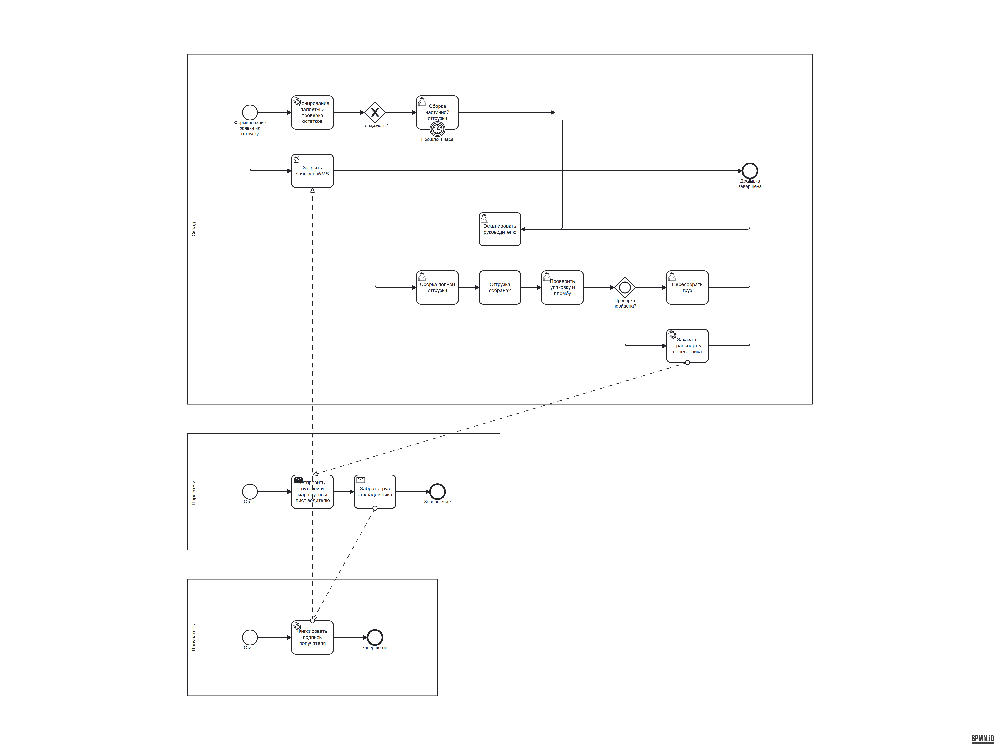
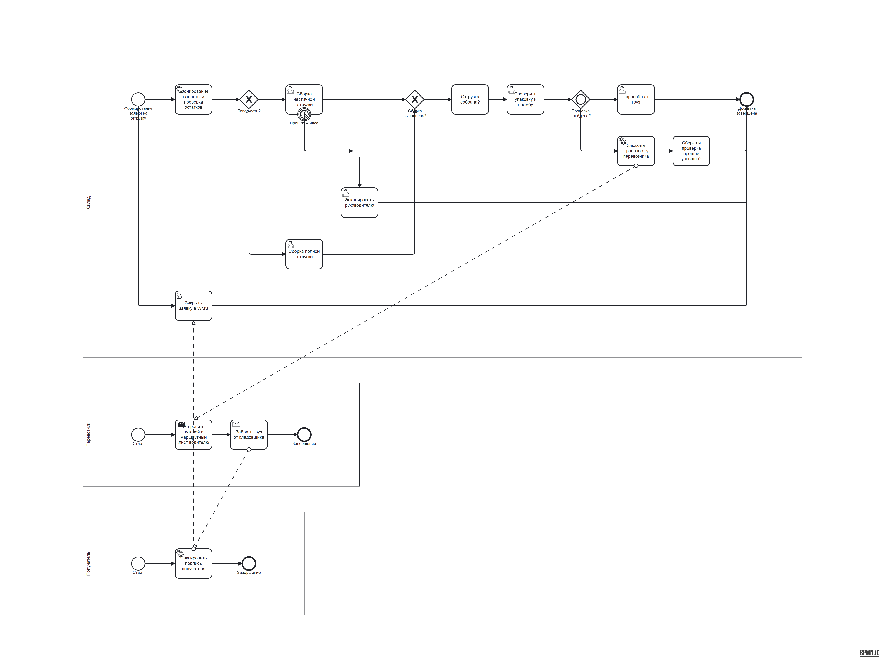

# Доставка груза на складе: прогон после правок генерации, Improve и скоринга

Дата — 21.09.2026. Прогон через HTTP-маршруты платформы (`/api/generate` →
`/api/evaluate` → `/api/ai/improve` → `/api/ai/accept-improvement`),
провайдер — GigaChat, стенд локальный. PNG нарисованы тем же кодом, что и в
редакторе: `src/bpmnLayout.js` (`bpmn-auto-layout` + bpmn-js viewer + puppeteer).

Отчёт сравнивает «до» и «после» на одном и том же сценарии. Первый прогон —
`reports/warehouse-delivery/` (схема на 8 пулов, четыре из которых пустые).

## 1. Что было не так по словам владельца

1. пулы, в которых только `startEvent` и `endEvent`;
2. лишние пулы: роли одной организации разведены по участникам вместо дорожек;
3. нет корректных развилок — шлюз на расщеплении без парного шлюза схождения;
4. нет логики промежуточных событий (таймеры SLA, ожидания).

## 2. Что изменилось в контуре

| Слой | Правка |
| --- | --- |
| Генерация | план модели проверяется `plan_gaps` на то, что нельзя починить честно; нарушения — повод для одного переспроса с тем же системным промптом |
| Генерация | `_drop_vacant_pools` — пул без шагов удаляется вместе со своими событиями и потоками |
| Генерация | `_merge_role_pools` — пул, который модель сама объявила дорожкой, сливается в пул-приёмник, messageFlow между ними становится sequence |
| Генерация | `_explicit_merge_gateways` — перед узлом с ≥2 входящими вставляется шлюз схождения того же типа, что расщепляет ветки; при разнобое предков вставки нет |
| Генерация | `_ensure_gateway_default` — единственная безусловная ветка становится `default`; при двух выбор не навязывается |
| Генерация | события получили определения (`timer`/`message`/`error`/`signal`) с хронометражем ISO-8601, `boundaryEvent` с `attachedToRef`, `documentation` у шагов |
| Улучшение | операции `set_default`, `merge_participants`, `remove_participant`, `duration`/`cycle` у таймера, `cancelActivity` у граничного события |
| Улучшение | пакет, создавший цикл без защищённого выхода, откатывается к исходной схеме (`has_unguarded_cycle`) |
| Улучшение | новый `add_boundary_event` без ветки обработки откатывается, как и остальные новые узлы |
| Скоринг | 12 правил → 16 (суммарный вес 146): `pool_has_steps`, `participant_interacts`, `gateway_split_join`, `boundary_events`; `pool_lanes`, `event_types`, `end_event` перестали мерцать |
| Скоринг | `diff_scores` — дельта по правилам; принятие улучшения отдаёт её фронтенду |
| Метрики | пакет `eval/`: независимый оракул инвариантов, 8 сценариев, 11 кейсов, режимы replay/live, baseline и детектор регрессий |

## 3. Генерация

20.4 с, HTTP 200, **две попытки** (переспрос сработал: «нарушений было 4,
стало 2»), балл качества **95/100**.

| Показатель | Прогон до правок | Этот прогон |
| --- | --- | --- |
| пулов | 8 | 3 (Склад, Перевозчик, Получатель) |
| пулов без шагов | 4 | 0 |
| дорожек | 0 | 6 |
| событий без определения | 1 | 0 |
| таймеров | 0 | 1 (граничный `PT4H` на сборке) |
| выходов по умолчанию у шлюзов | 0 | 1 |
| балл старым скорингом | 85 | 95 |
| балл новым скорингом | 71 | 95 |

Нарушения, которые план модели содержал до починки (из `gaps`):

> «Экспедитор» объявлен пулом и одновременно дорожкой в пуле «Склад» — роли
> одной организации живут дорожками одного пула
>
> шлюз G2 (Отгрузка собрана?) не раздваивает и не сливает маршруты — это
> обычный шаг

Первое закрыто слиянием в дорожку, второе — понижением до задачи. Правок
починки — 17, каждая названа в `notes`; среди них:

> Ветка F11 шлюза G1 объявлена выходом по умолчанию: она единственная без условия
>
> Выход по умолчанию снят с потока F11: у неэксклюзивного шлюза его не бывает

Непройденное правило одно — `documentation` (описаний нет ни у одного из 21
элемента): генератор умеет их писать, но модель в этом прогоне не заполнила
поле `documentation`.

## 4. Improve отдельным запросом

36.2 с, HTTP 200, статус `partial`. Запрос:

> Схема сырая по качеству: добавь контроль срока отгрузки (таймер SLA) на шаге
> сбора груза с веткой эскалации руководителю смены и документацию к шагам, где
> есть ветвление. Развилки закрой парными шлюзами схождения, новых пулов не
> заводи, а пул без шагов удали.

Применено 5, отклонено 4:

| Операция | Итог |
| --- | --- |
| `add_boundary_event new_TimerEvent` | применена — «прицеплено к «A2», длительность PT2H» |
| `add_documentation A2`, `A3` | применены |
| `add_gateway new_GatewayOut` + `move_to_lane` | применены — потоки после `A3` переподвешены через новый шлюз |
| `connect new_TimerEvent → new_TaskEscalate` | «такой поток уже существует» |
| `set_default G2` | «элемент «G2» не является шлюзом» — G2 понижен до задачи при генерации |
| `add_task new_TaskEscalate` | «тупик: вход есть, выхода нет — изменение откачено» |

## 5. Принятие

Отдельный прогон с сохранённой в реестре схемой: HTTP 200, балл **95 → 95**,
`rules_delta` в ответе — `{score_before: 95, score_after: 95, rules: {}}`.

Это и есть цель правки. До неё тот же маршрут давал **95 → 88**: пакет
замыкал цикл без защищённого выхода, и `guarded_cycles` падал — принятие
улучшения тихо ухудшало схему. Теперь такой пакет откатывается к исходному
XML, а модель получает подсказку «верните ветку через исключающий шлюз, у
которого есть выход из цикла» и шанс добить её корректирующим повтором.
Аналогично откатывается новый `add_boundary_event` без ветки обработки:
раньше такой таймер оставался в схеме и стоил ей балла.

## 6. Метрики контура (`python -m eval.run --mode replay`)

11 кейсов: 8 сценариев, «хорошие» и «плохие» записанные ответы модели плюс
реальный план из прошлого прогона.

| Метрика | Значение |
| --- | --- |
| pass@1 по сценарию | 0.545 |
| `pool_has_steps`, `roles_as_lanes`, `gateway_split_join`, `boundary_handled`, `no_unrouted`, `min_steps` | 1.00 |
| `participant_interacts` | 0.889 |
| `has_branching`, `expected_participants` | 0.818 |
| `gateway_conditions_or_default` | 0.778 |
| `has_timer` | 0.600 |
| `event_definitions` | 0.500 |
| структура и XML не расходятся по инвариантам | 1.00 |
| правок починки на схему | 7.5 |
| средний балл скоринга | 88.9 |
| улучшение: доля применённых операций | 0.75 |
| улучшение: дельта балла после пакета | −4 |
| улучшение: пакет не испортил схему | 0.50 |

Что читают из этих чисел разработчики:

1. `event_definitions` 0.5 и `has_timer` 0.6 — единственные инварианты,
   которые починка вытянуть не может: определение события знает только модель.
   Именно они и должны быть мишенью для промпта и переспроса.
2. `improve/score_delta` −4 на историческом пакете — это тот самый класс
   дефекта из раздела 5, зафиксированный как метрика, а не как случайность.
3. `pool_has_steps` и `roles_as_lanes` по 1.0 означают, что пустые и
   избыточные пулы больше не доезжают до пользователя: их либо сливает в
   дорожку, либо удаляет.

## 7. Что осталось

- `documentation` по-прежнему не заполняется моделью при генерации: поле в
  плане есть, в промпте пример есть, в этом прогоне модель его не использовала.
- Разброс между прогонами живёт: два прогона одного сценария дали 5 и 7
  применённых операций и разный набор отклонений.
- `GIGACHAT_VERIFY_SSL=false` в локальном `.env` — временная мера (сертификат
  российского УЦ), в проде нужен CA-bundle; ключ из исходников подлежит ротации.
- Пороги регрессии по метрикам улучшения не заданы: нужно 3–5 живых прогонов,
  чтобы не ловить шум.
