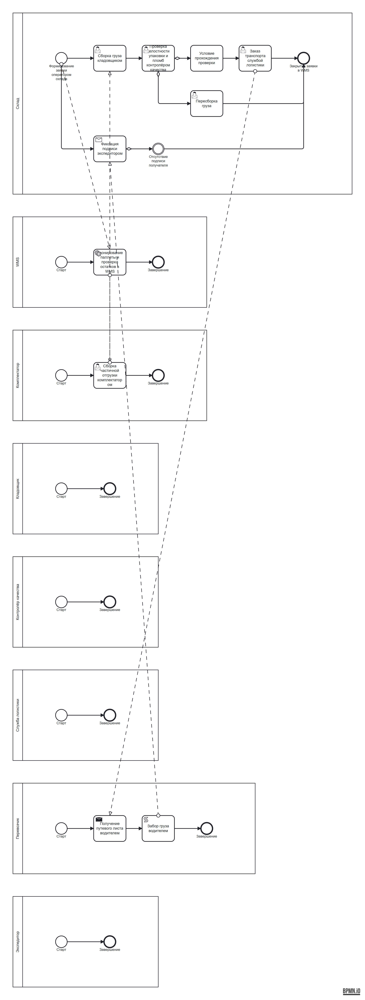
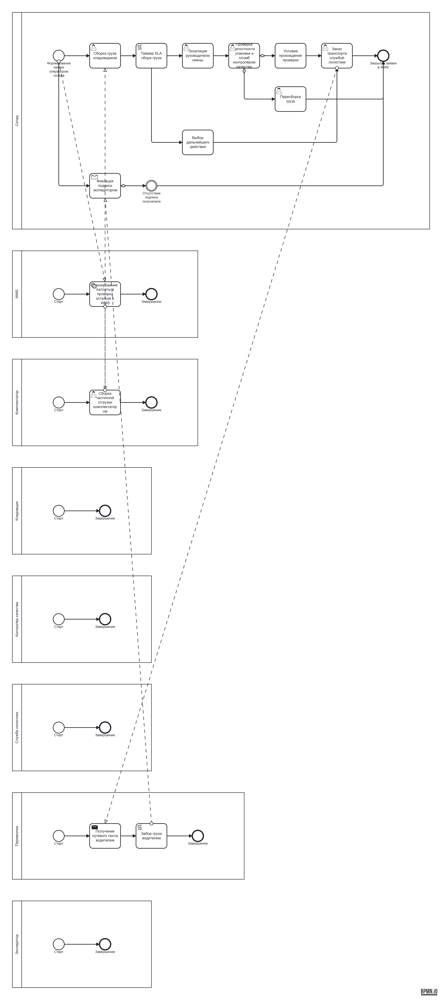

# Доставка груза на складе: генерация и Improve схемы живым контуром

Прогон 21.09.2026 через HTTP-маршруты платформы (`/api/generate` →
`/api/ai/improve` → `/api/ai/accept-improvement`), провайдер — GigaChat.
Артефакты прогона лежат рядом: `process.bpmn` (сгенерированная схема),
`process_improved.bpmn` (после принятия), `run.json` и `improve_response.json`
(полные отчёты). PNG нарисованы тем же стеком, что и в приложении:
`bpmn-auto-layout` + bpmn-js viewer.

Сценарий для генерации:

> Автоматизированная доставка груза на складе. Оператор склада формирует
> заявку на отгрузку в WMS и указывает адрес и вес груза. Система автоматически
> бронирует паллету и проверяет остатки. Если товара недостаточно, комплектатор
> собирает частичную отгрузку и ждёт поступления остатка со следующего склада.
> Кладовщик собирает груз, контролёр качества проверяет целостность упаковки и
> пломбы; при непройденной проверке груз возвращается на пересборку. Служба
> логистики заказывает транспорт у перевозчика, водитель получает путевой и
> маршрутный лист, забирает груз и доставляет его получателю. Экспедитор
> фиксирует подпись получателя и закрывает заявку в WMS.

Запрос на улучшение — отдельным шагом, после генерации:

> Схема сырая по качеству: добавь контроль срока отгрузки (таймер SLA) на шаге
> сбора груза с веткой эскалации руководителю смены и документацию к шагам, где
> есть ветвление. Новые шаги встраивай в маршрут существующего пула, новых
> пулов не заводи.

## 1. Генерация

8.3 с, HTTP 200. 8 пулов, 27 элементов, 5 потоков-сообщений,
балл качества **85/100**.

Непройденные правила скоринга:

| Правило | Что не так |
| --- | --- |
| `event_types` | A11 — промежуточное событие без определения (таймер/сообщение/ошибка) |
| `documentation` | описаний нет ни у одного элемента |

Платформа поправила структуру за моделью 33 раза; характерные правки:

- `Элемент A5: пул не указан, взят пул дорожки «Контролёр качества» — «Склад»` —
  модель не указала участника, пул восстановлен по дорожке;
- `Поток S1 → A1 между пулами преобразован в потоковое сообщение: если это
  роли одной организации, они должны быть дорожками одного пула` — sequence-
  поток через границу пула недопустим, поэтому он стал messageFlow;
- `Условие на потоке A4 → A5 сохранено, но источник не шлюз` — условие
  ветвления осталось подписью на потоке;
- `Элемент A14 без названия — подписан типом «intermediateThrowEvent»`.

## 2. Improve отдельным запросом

17.6 с, HTTP 200, статус `partial`. Вывод модели дословно:

> добавлены таймеры SLA и эскалация руководителя смены при превышении времени
> выполнения задач сбора груза и проверки упаковки
>
> Не применено (требует уточнения):
> - план: connect: такой поток уже существует
> - план: add_gateway: не задано имя элемента
> - план: add_flow: неизвестная операция
> - план: add_flow: неизвестная операция
> - повтор: add_task: новый шаг (new_timer_task_2) недостижим: выход есть,
>   входа нет — изменение откачено

### Применено

| Операция | Элемент | Пояснение аплайера |
| --- | --- | --- |
| `add_task` | `new_timer_task` | потоки после `A3` переподвешены через новый шаг |
| `add_task` | `new_escalation_task` | потоки после `new_timer_task` переподвешены через новый шаг |
| `add_documentation` | `A3`, `A4` | описание шага |
| `add_gateway` | `new_gateway` | «Выбор дальнейшего действия» |
| `connect` | ×2 | новые ветки маршрута |

### Отклонено и почему

| Раунд | Операция | Причина |
| --- | --- | --- |
| план | `connect` | такой поток уже существует |
| план | `add_gateway` | не задано имя элемента |
| план | `add_flow` ×2 | операции с таким именем нет в словаре аплайера |
| повтор | `add_task new_timer_task_2` | шаг недостижим: выход есть, входа нет — откачен |
| повтор | `add_event new_intermediate_catch` | шаг недостижим — откачен |
| повтор | `add_task new_escalation_task_2` | тупик: вход есть, выхода нет — откачен |

Откат — не ошибка применения: пакет модели не сошёлся в валидный маршрут, а
принимать шаг без связи нельзя, иначе схема после принятия станет хуже.
Пометка починки, которая сработала на этой схеме:

> `шлюз «Выбор дальнейшего действия» (new_gateway) с единственной веткой
> понижен до задачи; условие с потока снято`

## 3. Принятие

HTTP 200, версия 2, балл качества **85 → 85**: схема не ухудшилась, два шага
и две документации в неё вошли, но правилу `documentation` этого мало
(описания есть у 2 элементов из 32), а `event_types` остаётся непройденным.

## 4. Что видно на схеме, но не видит скоринг

1. **Четыре пустых пула** — «Кладовщик», «Контролёр качества», «Служба
   логистики» и «Экспедитор» содержат только `Старт → Завершение` без единого
   шага. Балл за это не отвечает: каждый процесс формально имеет вход и выход.
2. **Восемь пулов вместо одного с дорожками.** По методологии роли сотрудников
   одной организации — дорожки внутри пула, отдельный пул заводят только для
   внешнего участника (WMS, перевозчик, получатель). Модель распределяет по
   пулам комплектатора, кладовщика, контролёра качества, службу логистики и
   экспедитора, а линейный поток распадается в цепочку messageFlow. Промпт это
   запрещает, но запрет декларативный: детерминированной проверки
   «роль ≠ участник» в контуре нет.
3. **Результат скачет между прогонами.** Тот же сценарий и тот же запрос ранее
   за день дали 87 → 94: модель добавила таймер SLA и эскалацию в маршрут. В
   этом прогоне план оказался с выдуманной операцией `add_flow` и тремя
   несвязанными шагами, поэтому прироста не было.

Отсюда три предложения по развитию контура, если цель — стабильный прирост
качества, а не отдельный удачный прогон:

- **правило связности участников в скоринге**: пул без messageFlow и пул без
  шагов должны стоить баллов — сейчас `no_isolated` смотрит на элементы, а не
  на участников;
- **нормализация «роль → дорожка» при починке структуры**: пул, где все шаги —
  сотрудники основной организации, переносить дорожкой в главный пул, а не
  рисовать отдельным участником;
- **в отчёте принятия показывать дельту по правилам**, а не только итоговый
  балл: «85 → 85» не объясняет пользователю, что два шага добавлены и прирост
  съеден требованием документации.
